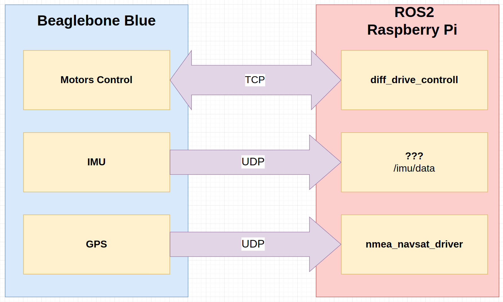

# KPI Rover chassis controller based on Beaglebone Blue

For the first time, the Beaglebone board should be prepared. Please refer to the section [Preparing Beaglebone Blue Board](#Preparing-Beaglebone-Blue-Board).

## Communication between BBB and ROS2


## Download Source Code
```
git clone --recurse-submodules git@github.com:KPI-Rover/ecu_sw_bb.git
cd ecu_sw_bb
```

Alternatively, if you've already cloned the repository without submodules:
```
cd ecu_sw_bb
git submodule init
git submodule update
```

## Preparing Beaglebone Blue Board

### Download and flash image

For the Beaglebone Blue, to be able to use all robotic peripherals and the librobocontrol without much effort, the best images are:
- Boot from microSD: [bone-debian-10.13-console-armhf-2023-07-01-1gb.img.xz](https://rcn-ee.com/rootfs/release/2023-07-01/buster-console-armhf/bone-debian-10.13-console-armhf-2023-07-01-1gb.img.xz)
- Boot from eMMC (Recommended and used in this project): [bone-eMMC-flasher-debian-10.13-console-armhf-2023-07-01-1gb.img.xz](https://rcn-ee.com/rootfs/release/2023-07-01/buster-console-armhf/bone-eMMC-flasher-debian-10.13-console-armhf-2023-07-01-1gb.img.xz)

Using the latest IoT images requires a lot of manual work to make it run.

#### Flashing instructions
1. Flash the downloaded image on an SD card. The Raspberry Pi imager or the Etcher utility can be used.
2. Power off the Beaglebone Blue board.
3. Insert the SD card into the board.
4. Hold the SD button (located near PWMs pin headers).
5. Power on the board.
6. The flashing process should start. It can take up to 10 minutes.

#### How to Confirm Flashing?
* Initially, the board will show a blue heartbeat LED indicating that the image has booted.
* During the flashing process, the blue user LEDs will light up in a "scanner" pattern (back and forth).
* When finished, all blue LEDs will either remain on or the board will power off automatically.
* If the LEDs stay on for too long, it may indicate a failure (e.g., wrong image). Verify by attempting to boot again.

### Setup SSH connection over USB
Recommended for the first time. Connect the Beaglebone Board to your PC using a micro USB cable. The board has a USB gadget that allows using network over USB.
```
ssh debian@192.168.7.2
Password: temppwd
```

### Connect Board to WiFi
```
connmanctl
connmanctl> tether wifi off
connmanctl> enable wifi
connmanctl> scan wifi
connmanctl> services
connmanctl> agent on
connmanctl> connect wifi_f45eab2f1ee1_6372797774616c_managed_psk (Replace with your network)
connmanctl> quit
```
Now you can use the wifi connection to establish an ssh connection.

### Upgrade and install required packages
```
sudo apt update
sudo apt install -y locales
sudo dpkg-reconfigure locales # Choose a locale en_US.UTF-8 = English, United States, UTF8
sudo apt upgrade -y
sudo apt install build-essential -y
sudo apt-get install -y cpufrequtils
sudo sed -i 's/GOVERNOR="ondemand"/GOVERNOR="performance"/g' /etc/init.d/cpufrequtils
```

### Install librobotcontrol
#### Download source code
```
cd ~
git clone --branch V1.0.5 https://github.com/beagleboard/librobotcontrol.git
cd librobotcontrol
```

#### Build and install library
```
sudo make install
```

#### Test drivers
```
rc_test_drivers
```
You should be able to see output as follows:
```
Kernel: 4.19.94-ti-r74
BeagleBoard.org Debian Buster Console Image 2023-07-01
Debian: 10.13

PASSED: gpio 0
PASSED: gpio 1
PASSED: gpio 2
PASSED: gpio 3
PASSED: pwm0
PASSED: pwm1
PASSED: pwm2
PASSED: eqep0
PASSED: eqep1
PASSED: eqep2
PASSED: pru-rproc
PASSED: uart1
PASSED: uart2
PASSED: uart4
PASSED: uart5
PASSED: i2c1
PASSED: i2c2
PASSED: spi
PASSED: LED
PASSED: ADC iio

Currently running on a:
MODEL_BB_BLUE
Robot Control library Version:
1.0.5
```

#### Enable Background Services
```
sudo systemctl enable rc_battery_monitor
sudo systemctl start rc_battery_monitor

sudo systemctl enable robotcontrol
sudo systemctl start robotcontrol
```

## Build of project and loading on BBB

### Build Docker Image
```
docker build -t kpi-rover-bbb .
```

### Build application using Docker
```bash
./build.sh
```

### Upload binary file to Beaglebone Blue
```bash
export BBB_HOST=debian@<BeagleBone Blue IP>
./deploy.sh
```

## Running

### Connect to board using SSH 
Using USB over network

```
ssh debian@192.168.7.2:~
password: temppwd
```

If you set wireless interface

```
ssh debian@<bbb_local_ip>:~
password: temppwd
```

### Run program
```
./kpi_rover_ecu -a 0.0.0.0 -p 6000
```

## Fixing probable issues while debugging or testing

If server started on 192.168.7.2 :
```
(On PC) 
sudo route add -net 192.168.7.0 netmask 255.255.255.0 gw <bbb_local_ip>
```

If you have no address to connect usb-over-network

```
(On PC)
sudo ip addr add 192.168.7.1/24 dev enxf45eab505491
```

## References
- Original beagleboard.org documentation: https://docs.beagleboard.org/boards/beaglebone/blue/index.html
- Images Snapshot: https://forum.beagleboard.org/t/debian-10-x-buster-monthly-snapshot-2023-07-01-final/31203
- Ardupilot on Beaglebone Blue: https://ardupilot.org/copter/docs/common-beagle-bone-blue.html
- Robot Control Library Documentation: http://strawsondesign.com/docs/librobotcontrol/index.html